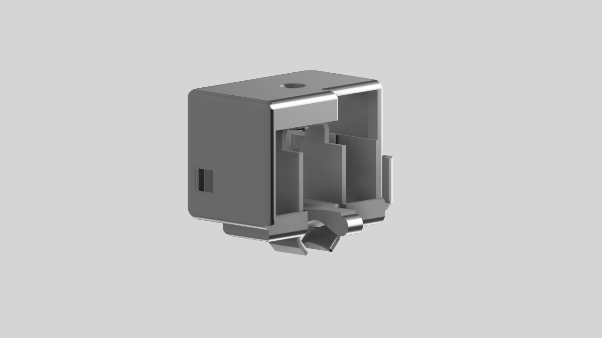
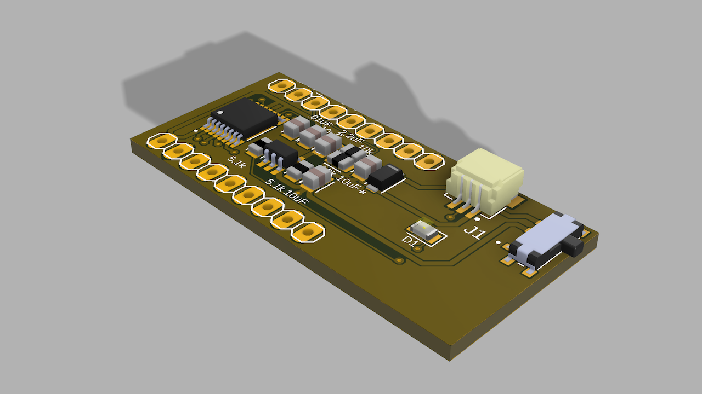
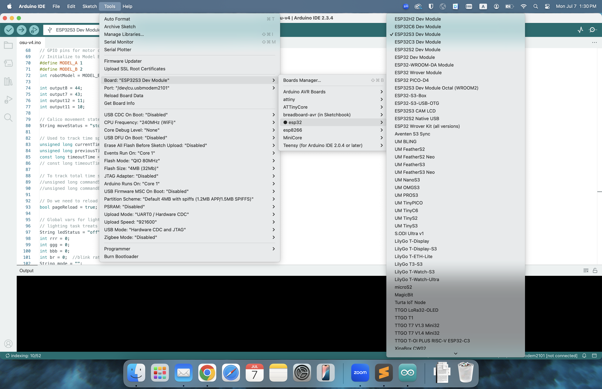

# Calico 🤖


**Calico** is a miniature relocatable wearable system with fast and precise locomotion for on-body interaction, actuation and sensing. 
Calico consists of a two-wheel robot and an on-cloth track mechanism or "railway," on which the robot travels. 
The robot is self-contained, small in size, and has additional sensor expansion options. 
The Calico robot can adapt for various applications and target for different audience such as older adults, dancers, and children. 
For example, we designed **[Dance^2](https://www.jonathan-david-martin.com/dance-squared)** with Calico to explore new forms of dance and movement, and to create a new form of interaction.
We also investigate how **[Calico for older adults](https://dl.acm.org/doi/10.5555/3721488.3721562)** can assist with daily activities and provide companionship. 

Please see the [Calico website](https://smartlab.cs.umd.edu/publication/calico) and [papers](https://dl.acm.org/doi/10.1145/3715336.3735828) for more details on the design and applications of Calico.

---

## 📦 Table of Contents

- [Features](#-features)  
- [Hardware setup (BOM)](#-hardware)  
- [Arduino Configuration](#arduino-configuration)
- [Connect & control the robot](#connect--control-the-robot)
- [Tips](#tips)

---

## ✨ Features

- Powerful MCU: ESP32 S3-Zero (Powered by [Waveshare](https://www.waveshare.com/wiki/ESP32-S3-Zero)) 
- DC Motor Driver: DRV 8835
- Wi-Fi connection and controlled
- LED strip for visual feedback
- LiPo's battery powered and charge via USB-C
- Graphical user interface (GUI) for real time control

---

## 🔧 Hardware

### Robot body and tracks 

- [Main body](./3D%20print%20models) 
  - 3D print material: PLA or Carbon PLA
  - Recommended print settings: 
    - Layer height: 0.2mm
    - Infill: 20% (or more for stronger body)
    - Print angle: 30 degrees
    - Supports: Yes 
  - Bamboo project file is included for reference: [3MF file](./3D%20print%20models/main_body.3mf)

- [Body cap](./3D%20print%20models) (Recommended setting same as above)
  - Require M2 screws and insert nuts to attach the body cap to the main body.
- [Wheels](./3D%20print%20models) (3D print material: PLA or Carbon PLA)
- [Track](./3D%20print%20models)
  - 3D print material: TPU Shore-95A
  - Recommended print settings: 
    - Layer height: 0.2mm
    - Infill: 20% 
    - Print angle: Flat (0 degrees)
    - Supports: Yes 
  - Bamboo project file is included for reference: [3MF file](./3D%20print%20models/track.3mf)
  - Tracks are designed in modular pieces, and you can print multiple pieces to create a longer track. 
    To connect the track pieces, you need a 1.75mm filament (e.g., PLA) and insert them into designed holes at the both end of the track pieces.
    
  - See below figures for references.
    


### Robot electronics

- MCU ([ESP32 S3-Zero](https://www.waveshare.com/wiki/ESP32-S3-Zero))
- Custom PCB ([See PCB folder for details](./PCB%20files))
- N20 DC motors
- LED strip (4 LEDs)
- 3.7V LiPo battery


---

## Arduino Configuration
The robot is powered by an ESP32 S3-Zero, which is programmed using the Arduino IDE. 
Please refer to the below steps to set up the Arduino IDE for Calico.
- Install the [Arduino IDE](https://www.arduino.cc/en/software).
- Add ESP32 board support by going to `File` > `Preferences` and adding the following URL to the "Additional Boards Manager URLs" field:
  ```
  https://dl.espressif.com/dl/package_esp32_index.json
  ```
- Open the Boards Manager from `Tools` > `Board` > `Boards Manager`, search for "ESP32," and install the latest version of the ESP32 board package.
- Select the ESP32 S3-Zero board from `Tools` > `Board` > `ESP32 S3 Dev Module`.
- Refer to the below image to configure the ESP32 settings:
- 

---

## Connect & control the robot
To connect and control the robot, follow these steps:
1. **Connect the robot to your computer** using a USB-C cable.
2. **Open the Arduino IDE** and select the correct port from `Tools` > `Port`.
3. **Change the WiFi credentials** in the `main_app.ino' file (line 46 - 49) to match your network:
   ```
   const char* ssid_dev = "your-ssid";
   const char* password_dev = "your-password";
   const char* ssid = "your-ssid";
   const char* password = "your-password";
   ```
4. **Upload the code** to the ESP32 S3-Zero by clicking the upload button in the Arduino IDE. (You only need to do this once. 
After you have updated the Wi-Fi credentials and uploaded the code into Calico robot, you can control the robot without needing to upload the code again.)
   - Make sure you have the correct board and port selected in the Arduino IDE.
   - The upload process may take a few minutes, and you will see the progress in the console at the bottom of the IDE.
5. Once the upload is complete, open the Serial Monitor from `Tools` > `Serial Monitor` to see the connection status.
6. If the robot connects successfully, you will see a message indicating the IP address assigned to the robot.
7. **Open the GUI** by navigating to the IP address in your web browser. The GUI will allow you to control the robot's movement and LED strip.

## Tips
1. The robot will light up the LED light on board in different colors based on its status:
   - **light off**: Robot not powered
   - **steady blue**: Wi-Fi connected
   - **flashing blue**: Trying to connect Wi-Fi
   
2. If you can not see the ip address from the serial port you can use LanScan tools to find the IP address of the robot. 
   - For example, you can use [LanScan](https://apps.apple.com/us/app/lanscan/id472226235?mt=12) or [Advanced IP Scanner](https://www.advanced-ip-scanner.com/).

3. All the connectors are JST PH 2.0
4. The robot can be charged via USB-C port. (**be careful with the battery +/- directions**)
   - The battery is 3.7V LiPo battery, and the charging current is 500mA.
   - The battery can be replaced if needed.
  


