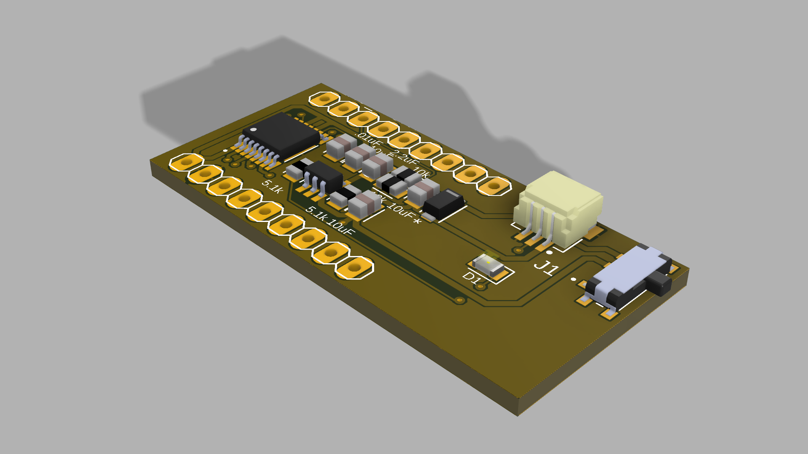

# Calico 🤖

**Calico** is a miniature relocatable wearable system with fast and precise locomotion for on-body interaction, actuation and sensing. 
Calico consists of a two-wheel robot and an on-cloth track mechanism or "railway," on which the robot travels. 
The robot is self-contained, small in size, and has additional sensor expansion options. 

For more detailed information, please refer to the [paper website](https://smartlab.cs.umd.edu/publication/calico).

---

## 📦 Table of Contents

- [Features](#-features)  
- [Hardware setup (BOM)](#-Hardware)  
- [Usage](#-usage)  
- [Configuration](#-configuration)  
- [Examples](#-examples)  
- [Contributing](#-contributing)  
- [Roadmap](#-roadmap)  
- [License](#-license)  
- [Acknowledgements](#-acknowledgements)

---

## ✨ Features

- Powerful MCU: ESP32 S3-Zero (Powered by [Waveshare](https://www.waveshare.com/wiki/ESP32-S3-Zero)) 
- DC Motor Driver: DRV 8835
- WiFi connection and controlled
- LiPo battery powered and charge via USB-C
- Graphical user interface (GUI) for easy control

---

## 🔧 Hardware

### Robot body and tracks
- Main body (3D print: PLA)
- Body cap (3D print: PLA)
- Wheels (3D print: PLA or Carbon PLA)
- Track (3D print: TPU)
- M2 screws and insert nuts 

### Robot electronics

- MCU (ESP32 S3-Zero)
- Custom PCB ([See PCB folder for details](./PCB%20files))
- N20 DC motors
- LED strip (4 LEDs)
- 3.7V LiPo battery

